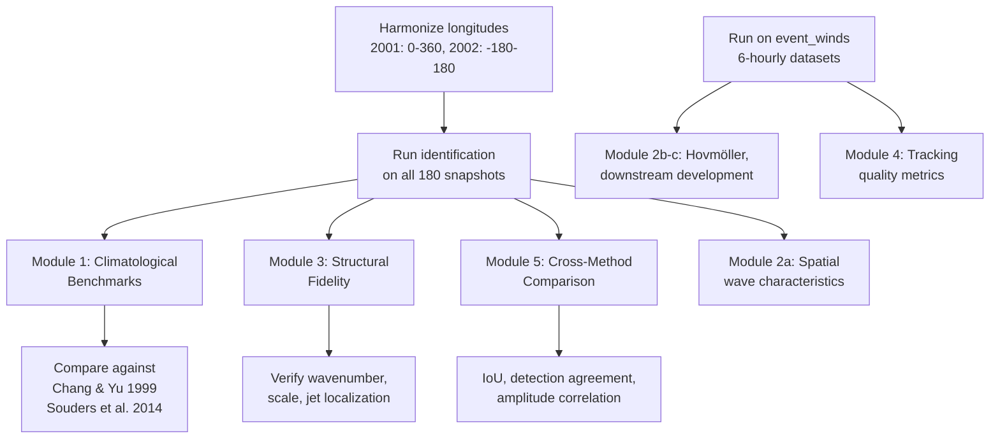

# WAPER Performance Evaluation Design — Physically-Oriented

> Using `2001.nc` and `2002.nc` (ERA5, 300 hPa v-wind, 0.25° × 0.25°, 90 snapshots per year, full globe) to comprehensively evaluate the WAPER RWP tracker.

## Dataset Characteristics

| Property | 2001.nc | 2002.nc |
|----------|---------|---------|
| Variable | `v` (meridional wind at 300 hPa) | Same |
| Resolution | 0.25° × 0.25°, 721 lat × 1440 lon | Same |
| Time | 90 snapshots (2001-01-01 to 2001-12-31) | 90 snapshots (2002-01-01 to 2002-12-31) |
| Sampling | ~4-day intervals (GRIB subsampled) | Same |
| Pressure level | 300 hPa (single level) | Same |
| Longitude | 0°–360° | −180°–180° (⚠️ needs harmonizing) |

> [!WARNING]
> The two datasets have **different longitude conventions** (0–360 vs −180–180). This must be harmonized before comparison. Additionally, the ~4-day temporal spacing means the data is **not continuous 6-hourly** — this severely limits tracking-across-timesteps diagnostics but is fine for per-snapshot identification statistics.

> [!NOTE]
> At ~4-day spacing, consecutive snapshots are meteorologically independent. This means we cannot evaluate temporal tracking fidelity with these datasets alone, but we get 180 independent snapshots for robust identification statistics. The existing `event_winds_abs_{1,2}.nc` datasets (81 6-hourly timesteps each) should be used for tracking evaluation.

---

## What Exists vs. What's Missing

### Already implemented (in [sensitivity.py](file:///Users/joymonteiro/github/waper/datasets/sensitivity.py), [gt_sensitivity.py](file:///Users/joymonteiro/github/waper/datasets/gt_sensitivity.py), [penalty_sensitivity.py](file:///Users/joymonteiro/github/waper/datasets/penalty_sensitivity.py)):
- ✅ Parameter sensitivity sweeps (GT, ST, penalty)
- ✅ Per-sweep statistics: edges/RWP, edge lengths, E–W extent, RWPs/timestep
- ✅ Edge length histograms
- ✅ Baseline per-timestep diagnostics

### Missing — what this evaluation adds:
- ❌ **Comparison against published climatological values** (Chang & Yu 1999; Souders et al. 2014)
- ❌ **Geographic distribution** of RWP genesis/lysis/occurrence
- ❌ **Phase speed and group velocity** distributions
- ❌ **Downstream development signature** verification
- ❌ **Wavenumber spectrum** of detected RWPs
- ❌ **Seasonal cycle** of RWP activity
- ❌ **Cross-method comparison** against envelope methods
- ❌ **Structural fidelity** checks (zonal scale, latitudinal localization)

---

## Module 1: Climatological Benchmarks

**Goal:** Verify that aggregate RWP statistics fall within the ranges established in the literature.

### 1a. RWP Occurrence Frequency

Compute for each timestep (NH midlatitudes, 20°–80°N):
- Number of RWPs detected per timestep
- Fraction of timesteps with ≥1 RWP

**Expected values** (from Chang & Yu 1999; Souders et al. 2014; Fragkoulidis & Wirth 2020):
| Quantity | DJF target | JJA target |
|----------|-----------|-----------|
| RWPs per snapshot (NH) | 3–6 | 2–4 |
| Fraction of snapshots with ≥1 RWP | >0.9 | >0.8 |
| Mean RWP zonal extent | 40°–80° longitude | 30°–60° |

**Implementation:**
```python
# For each timestep, run identification and collect:
stats = {
    "n_rwps": [],            # len(identified_rwp_paths)
    "n_nodes_per_rwp": [],   # len(path) for each path
    "zonal_extent_deg": [],  # max_lon - min_lon of nodes
    "mean_latitude": [],     # weighted mean lat of nodes
}
```

### 1b. Geographic Distribution

Compute on a 10° × 10° grid:
- **RWP occurrence density**: fraction of timesteps where at least one RWP node falls in each grid cell
- **RWP centroid density**: histogram of RWP weighted centroids

**Expected pattern** (from Chang & Yu 1999, Fig. 9):
- Maximum RWP coherence along a band: North Africa → southern Asia → Pacific → North America → North Atlantic
- Peak occurrence over southern Asia and Pacific storm track entrance
- Very low activity in deep tropics and near the Aleutian low
- Secondary waveguide across Russia toward Pacific

**Diagnostic figure:** Polar stereographic map of RWP occurrence density with the expected waveguide overlaid.

### 1c. Seasonal Cycle

Stratify the 180 snapshots by month:
- RWP count per snapshot (monthly means)
- Mean zonal extent (monthly)
- Mean amplitude (monthly)

**Expected:** Clear winter maximum (DJF) and summer minimum (JJA), roughly factor of 1.5–2× difference in RWP count.

---

## Module 2: Dynamics Diagnostics

**Goal:** Verify that the detected RWPs exhibit the physical signatures of Rossby wave dynamics.

### 2a. Phase Speed and Group Velocity (per-snapshot proxy)

Since the dataset lacks continuous time resolution, estimate these from the **spatial structure** of each identified RWP:

- **Implied wavenumber** from the number of half-wavelengths: `k = π × n_nodes / zonal_extent_rad`
- **Implied phase speed** using Rossby wave dispersion: `c_p = U̅ - β / (k² + l²)` where `U̅` is the zonally-averaged 300 hPa wind at the RWP's latitude (computable from the v-field's companion u-field, or use ERA5 climatological U̅)
- **Edge-implied half-wavelength**: half the mean edge length gives the quarter-wavelength → full wavelength

**Expected values** (from Chang & Yu 1999):
| Quantity | Target |
|----------|--------|
| Dominant zonal wavenumber | 5–8 (2250–3600 km half-wavelength at 45°N) |
| Phase speed | ~10–15 m/s eastward |
| Group velocity / phase speed ratio | ~1.5–2.5 |

> [!TIP]
> Even without continuous tracking, the **spatial structure** of each RWP constrains its wave characteristics. An RWP with 5 nodes (max-min-max-min-max) spanning 60° at 45°N implies wavenumber ~6, consistent with the expected range.

### 2b. Downstream Development Signature

For the continuous-time event datasets (`event_winds_abs_1.nc`, `event_winds_abs_2.nc`):

1. Compute Hovmöller diagram of v' (meridional wind anomaly) along 45°N
2. Compute Hovmöller of wave packet envelope (using the per-node amplitudes along tracked paths)
3. Measure the **tilt** of:
   - Phase lines (individual ridges/troughs) → phase speed
   - Envelope lines (wave packet envelope) → group velocity

**Verification:** The envelope slope should be steeper (faster eastward) than the phase slope. Ratio should be ~2. This is the hallmark of downstream development.

**Implementation:** Use one-point lag-correlation of meridional wind at multiple base longitudes along 45°N, following Chang & Yu (1999) Section 3.

### 2c. Zonal Propagation Direction

For each detected RWP, check:
- The association graph edges are monotonically eastward (already enforced by `_is_monotonic_east`)
- The **amplitude gradient** (stronger at leading/eastern edge during growth phase)

Compute:
- Fraction of RWPs where the easternmost node has higher amplitude than the westernmost → expect >0.5 during active growth
- Histogram of east-west amplitude asymmetry ratio

---

## Module 3: Structural Fidelity

**Goal:** Verify that the spatial structure of detected RWPs is physically consistent.

### 3a. Zonal Scale Distribution

For each detected RWP:
- Compute the mean edge length (haversine distance between consecutive max-min nodes)
- Convert to equivalent wavenumber at the RWP's latitude

**Expected** (Pandey et al. 2020; Wirth et al. 2018):
| Metric | Target range |
|--------|-------------|
| Mean edge length | 1500–3000 km |
| Equivalent half-wavelength | 1500–3500 km |
| Equivalent zonal wavenumber | 5–8 at 40°–60°N |
| Nodes per RWP | 3–9 |

**Diagnostic:** Histogram of edge lengths overlaid with the Pandey et al. (2020) Fig. 4 reference values (already partially done in the sweep scripts but needs to be run on 2001/2002 data with the chosen operating point).

### 3b. Latitudinal Localization

RWPs should be concentrated near the jet stream:

- Compute the meridional distribution of RWP node latitudes
- Compare with the 300 hPa zonal-mean zonal wind (jet position)

**Expected:** RWP node density should peak within ±10° of the jet maximum (~30°–50°N in winter, ~40°–60°N in summer).

### 3c. Alternating Structure Verification

Each RWP path should alternate between max-nodes and min-nodes. This is implicit in the association graph construction but should be verified:

- Fraction of paths with strictly alternating max/min nodes = 1.0 (this is a hard invariant)
- For each max-node, the scalar value should be positive; for min-nodes, negative

### 3d. Amplitude Distribution

- Histogram of max-node amplitudes and min-node amplitudes
- Compare against the `node_pruning_threshold` (ST = 20 m/s currently)

**Expected:** Amplitudes in the 20–60 m/s range (stronger in winter), with a long tail from blocking events and cutoff lows.

---

## Module 4: Tracking Quality

> [!IMPORTANT]
> This module requires **continuous 6-hourly data** and cannot be run on the 2001/2002 datasets (which are ~4-day spaced). Use `event_winds_abs_1.nc` (81 timesteps, June 1980) and `event_winds_abs_2.nc` (81 timesteps, Jun–Jul 1981) instead.

### 4a. Track Duration Distribution

**Expected** (Souders et al. 2014; Fragkoulidis & Wirth 2020):
| Metric | Target |
|--------|--------|
| Median track duration | 2–4 days |
| Mean track duration | 3–5 days |
| Fraction lasting > 7 days | < 0.05 |

### 4b. Track Propagation Speed

For each track, compute:
- Mean propagation speed = total displacement / duration
- Should be **eastward** for all tracks (westward tracks are unphysical)

**Expected:** 20–35 m/s eastward (correlated with 200–400 hPa mean wind)

### 4c. Track Lifecycle

For each track, compute the time series of:
- Maximum amplitude within the RWP footprint
- Zonal extent

**Expected lifecycle** (Wirth et al. 2018): growth phase (increasing amplitude + extent) → mature phase (peak) → decay phase (decreasing), with downstream development: new wave crests appearing ahead.

### 4d. Split/Merge Events

Count how often:
- A single RWP at time `t` maps to 2+ RWPs at `t+1` (split)
- 2+ RWPs at time `t` map to 1 RWP at `t+1` (merge)

High split/merge rates indicate either real physical processes or parameter tuning issues. Compare split/merge rates at different GT/penalty values.

---

## Module 5: Cross-Method Comparison (Envelope Baseline)

**Goal:** Quantify agreement between WAPER and the standard Hilbert-transform envelope method. As proposed in [validation_strategy_plan.md](file:///Users/joymonteiro/github/waper/conductor/validation_strategy_plan.md) Layer 3.

### 5a. Implement Minimal Envelope Method

~30 lines of numpy/scipy:
```python
def hilbert_envelope(v_field, k_min=4, k_max=15):
    """Zimin et al. (2003) envelope."""
    v_fft = np.fft.fft(v_field, axis=-1)         # FFT along longitude
    k = np.fft.fftfreq(v_field.shape[-1], d=1) * v_field.shape[-1]
    mask = (np.abs(k) >= k_min) & (np.abs(k) <= k_max)
    v_filtered = np.fft.ifft(v_fft * mask, axis=-1).real
    analytic = scipy.signal.hilbert(v_filtered, axis=-1)
    return np.abs(analytic)
```

### 5b. Spatial Overlap Metrics

For each timestep:
1. Threshold the envelope at a standard value (e.g., 20 m/s) to get binary "envelope-detected" regions
2. Rasterize WAPER's RWP polygons to the same grid
3. Compute:
   - **IoU** (intersection over union) of the two binary fields
   - **Detection agreement**: fraction of timesteps where both methods detect ≥1 RWP

**Expected:** IoU > 0.3 on average (methods have different footprint shapes); detection agreement > 0.8.

### 5c. Amplitude Correlation

For each WAPER-detected RWP, compute the mean envelope amplitude within its footprint. Correlate with WAPER's scalar weight (max node amplitude).

**Expected:** Positive correlation, r > 0.5.

### 5d. Disagreement Catalogue

Identify the top 10% of timesteps by disagreement (low IoU or one-sided detection). These are scientifically interesting — they may reveal:
- Non-wavelike structures captured by WAPER but missed by the envelope
- Weak wave packets captured by the envelope but below WAPER's thresholds
- Cases where the envelope merges distinct wave packets that WAPER separates

---

## Implementation Strategy

### File structure
```
datasets/
  evaluate.py               # Main evaluation driver (Modules 1–3, 5)
  evaluate_tracking.py       # Module 4 (requires 6-hourly data)
  evaluation_utils.py        # Shared helpers (grid binning, envelope computation, etc.)
  experiments/
    YYYY-MM-DD-evaluation.md # Results log
  figures/
    evaluation/              # Output figures
```

### Execution plan



### Priority order
1. **Module 1** (Climatological Benchmarks) — most direct test of whether the algorithm is "working right"
2. **Module 3** (Structural Fidelity) — catches pathological RWPs early
3. **Module 2a** (Spatial wave characteristics) — verifies physical consistency per-snapshot
4. **Module 5** (Cross-Method Comparison) — quantifies agreement with established methods
5. **Module 2b-c, 4** (Dynamics + Tracking) — requires 6-hourly data, use event datasets

---

## Summary of Quantitative Targets

| Diagnostic | Expected range | Source |
|-----------|---------------|--------|
| RWPs per snapshot (DJF, NH) | 3–6 | Souders et al. 2014; Fragkoulidis & Wirth 2020 |
| RWPs per snapshot (JJA, NH) | 2–4 | Chang 1999 (Part II) |
| Mean edge length | 1500–3000 km | Pandey et al. 2020 |
| Dominant wavenumber | 5–8 | Chang & Yu 1999 |
| Nodes per RWP | 3–9 | Pandey et al. 2020 |
| RWP zonal extent | 40°–80° lon (winter) | Chang & Yu 1999 |
| Phase speed | 10–15 m/s | Chang & Yu 1999 |
| Group velocity / phase speed | 1.5–2.5 | Chang & Yu 1999 |
| Track duration (median) | 2–4 days | Souders et al. 2014 |
| Track propagation speed | 20–35 m/s eastward | Chang & Yu 1999 |
| IoU vs. envelope method | >0.3 mean | — |
| Detection agreement rate | >0.8 | — |

> [!NOTE]
> These targets come from NH winter (DJF) climatologies. Summer values are systematically smaller. The 2001/2002 datasets span the full year, so seasonal stratification is essential when comparing against these numbers.
